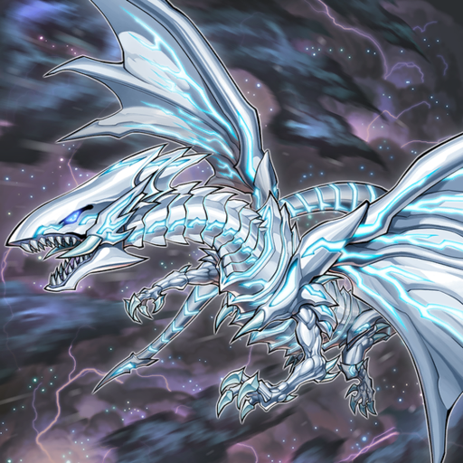

# YuGiOh Master Duel all cards art

Extract cards image data from "Yu-Gi-Oh! Master Duel" and rename files from card id to card name.

### Steps

* Download the game from Steam on Windows:  
  [steampowered.com/app/../YuGiOh_Master_Duel](https://store.steampowered.com/app/1449850/YuGiOh_Master_Duel/)

* Download app `AssetStudio` (to extract image data from the game)  
  [github.com/Perfare/AssetStudio](https://github.com/Perfare/AssetStudio/releases) or
  [its fork](https://github.com/zhangjiequan/AssetStudio).  
  (Default .NET verison on Windows is v4.x)

* Use `AssetStudio` to open directory `steamapps/common/Yu-Gi-Oh!  Master Duel`
  in the Steam library.  
  It takes a long duration and use almost all of your remaining RAM.  
  Change export option so output files group by path (default group by type).
  Filter the following file types to export:
  AudioClip, Font, Mesh, Sprite, TextAsset, Texture2D.

* Before run `cmd/rename_from_extracted/rename.go` to rename PNG files from card ID to card name,
  need to correct the input, output dirs in the Go code.

### Result

Example card `Blue-Eyes Alternative White Dragon`, game file `12253.png`,
renamed to `blue_eyes_alternative_white_dragon_12253.png`:

All arts result, uploaded on [Google drive](https://drive.google.com/drive/folders/1PVaWUaullSjaSKwbOi3Q1Xj024Qzq4YD?usp=share_link) (public read)

### References

* [Guide from Reddit](https://www.reddit.com/r/masterduel/comments/uszzul/guide_to_create_card_art_replacement_file_pc/)
* [Konami official cards database](https://www.db.yugioh-card.com/yugiohdb/card_search.action?ope=2&cid=4007&request_locale=en)
* [ygocdb.com for search YuGiOh card ID](https://ygocdb.com/)
* [Install Golang](https://golang.org/doc/install)
* [OCG art uncensored](https://www.youtube.com/watch?v=hXGVXXHT6us)
