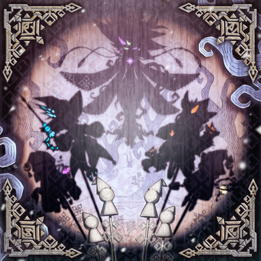

# YuGiOh Master Duel all cards art

Extract card image data from "Yu-Gi-Oh! Master Duel" and
rename files from Konami card IDs to card names.

## Steps

### Download the game from Steam

[steampowered.com/app/YuGiOh_Master_Duel](https://store.steampowered.com/app/1449850/YuGiOh_Master_Duel/)

### Download AssetStudio

AssetStudio is an app to extract Unity game assets.
Download from one of the following URLs:

- [github.com/zhangjiequan/AssetStudio](https://github.com/zhangjiequan/AssetStudio)
- [github.com/Perfare/AssetStudio](https://github.com/Perfare/AssetStudio/releases) (original, archived)

Default .NET verison on Windows is v4.x

### Prepare Steam account assets

On my Windows, each Steam accounts have its own game assets, located in
`D:\game\SteamLibrary\steamapps\common\Yu-Gi-Oh!  Master Duel\LocalData`

```bash
cd "/d/game/SteamLibrary/steamapps/common/Yu-Gi-Oh!  Master Duel/LocalData"
ls -lh --time-style=+%Y-%m-%d
# Output:
# 70102374 minahdao, English card art
# 2509bcbc bixuzofa, Japanese card art
# dca6ade4 em_chef_tft, duplicated English card art, move before extract

mv dca6ade4 /d/game/SteamLibrary/steamapps/common/localdata_dca6ade4
cd "/d/game/SteamLibrary/steamapps/common/Yu-Gi-Oh!  Master Duel/LocalSave"
mv dca6ade4 /d/game/SteamLibrary/steamapps/common/localsave_dca6ade4

ls /d/game/SteamLibrary/steamapps/common | grep local
# Output:
# localdata_dca6ade4/
# localsave_dca6ade4/
```

### Extract game assets

#### Load folder

Start `AssetStudio` (probably as administrator, so it has less memory errors).

File: Load folder: `D:\game\SteamLibrary\steamapps\common\Yu-Gi-Oh!  Master Duel`

This takes about 30 minutes and use almost all the computer remaining memory.

#### Export

* Options: Export options: Group exported assets by: container path
* Filter Type: choose all except the following types:
  - MonoBehaviour (a lot of human unreadable files)
  - Animator (probably they cause exporting errors)
* Export: Filtered assets: choose output to `D:\tmp_process_MD_file_by_path`
  (make sure the directory exists and empty).

This takes about 3 hours,
occasionally show errors and stuck, require human to click OK.

#### Konami ID to card name

We will use script `cmd\rename_from_extracted\rename.go`
to rename PNG files from Konami card ID to card name.

Make sure the input and output directories in the code are correct before running it,
they look like this on Windows:

```
dirSourceBase = `D:\tmp_process_MD_file_by_path`
dirTargetBase = `D:\tmp_process_MD_file`
```

The other script `cmd\mix_dir_card_id\mix_dir_card_id.go`
is copy card art with name as Konami card ID to `D:\tmp_process_MD_file\card_id`,  
then they will be uploaded to [mdygo.daominah.uk](https://mdygo.daominah.uk/) (by WinSCP),  
to serve the Card Editor on [daominah.github.io](https://daominah.github.io/).

#### Compare and copy new arts to the final directory

After the renaming script, the output are in `D:\tmp_process_MD_file`,
we want to update the final output in `D:\syncthing\Master_Duel_art_full`.

We use [Meld](https://meldmerge.org/) to compare the two directories,
only copy the new updated arts to the final directory (avoid re-sync old arts).

```bash

# on Windows:

cd /d/syncthing/Master_Duel_art_full

# meld MD_art_renamed/ /d/tmp_process_MD_file/MD_art_renamed/
meld MD_different_censored/ /d/tmp_process_MD_file/MD_different_censored/
# meld MD_token_monster/ /d/tmp_process_MD_file/MD_token_monster/


# on Linux:

# cd /media/tungdt/WindowsData/syncthing/Master_Duel_art_full

# meld MD_art_renamed /media/tungdt/WindowsData/tmp_process_MD_file/MD_art_renamed
# meld MD_different_censored /media/tungdt/WindowsData/tmp_process_MD_file/MD_different_censored
# meld MD_token_monster /media/tungdt/WindowsData/tmp_process_MD_file/MD_token_monster

```

Example, the Master Duel update in 2024-12, featuring White Forest archetype,
there are the following new cards:

```text
cat a.txt | awk '{print $NF}' | sort
# Output:
astellar_of_the_white_forest_20192.png
beware_the_white_forest_20238.png
cxyz_gimmick_puppet_fanatix_machinix_20222.png
diabell__queen_of_the_white_forest_20219.png
diabellze_the_original_sinkeeper_19853.png
elzette_of_the_white_forest_20193.png
emergency_apport_19828.png
flock_together_19527.png
gimmick_puppet_cattle_scream_20188.png
gimmick_puppet_fantasix_machinix_20221.png
gimmick_puppet_little_soldiers_20186_ocg.png
gimmick_puppet_little_soldiers_20186_tcg.png
gimmick_puppet_rouge_doll_20187.png
kuebiko_20421.png
magicolloidal_sol_20419.png
mansion_of_the_dreadful_dolls_20235.png
psychic_arsenal_19827.png
psychic_processor_19826.png
rciela__sinister_soul_of_the_white_forest_20218.png
rucia_of_the_white_forest_20195.png
scourge_of_the_white_forest_20532_ocg.png
scourge_of_the_white_forest_20532_tcg.png
service_puppet_play_20249.png
silhouhatte_rabbit_20231.png
silhouhatte_trick_20258.png
silvera__wolf_tamer_of_the_white_forest_20217.png
silvy_of_the_white_forest_20194.png
simultaneous_equation_cannons_19921.png
sinful_spoils_of_slumber___morrian_19916.png
sinful_spoils_subdual_19915.png
susurrus_of_the_sinful_spoils_20239.png
tales_of_the_white_forest_20237.png
vesper_girsu_20243.png
vulmina__statue_of_the_sacred_dragon_20420.png
way_where_there_s_a_will_19908.png
woes_of_the_white_forest_20250.png
```

## Result

All arts result are published at:

* https://mdygo.daominah.uk/  (powered by Cloudflared Tunnel)
* https://mdygo2048.daominah.uk/
* [Google Drive daominah@gmail.com](https://drive.google.com/drive/folders/1PVaWUaullSjaSKwbOi3Q1Xj024Qzq4YD?usp=share_link) (not updated frequently)

Example a card, `Tales of the White Forest`,  
game file `20237.png`,  
renamed to `tales_of_the_white_forest_20237.png`:



## References

* [Guide from Reddit](https://www.reddit.com/r/masterduel/comments/uszzul/guide_to_create_card_art_replacement_file_pc/)
* [Konami official cards database](https://www.db.yugioh-card.com/yugiohdb/card_search.action?ope=2&cid=4007&request_locale=en)
* [ygocdb.com for search YuGiOh card ID](https://ygocdb.com/)
* [Install Golang](https://golang.org/doc/install)
* [OCG art uncensored](https://www.youtube.com/watch?v=hXGVXXHT6us)
